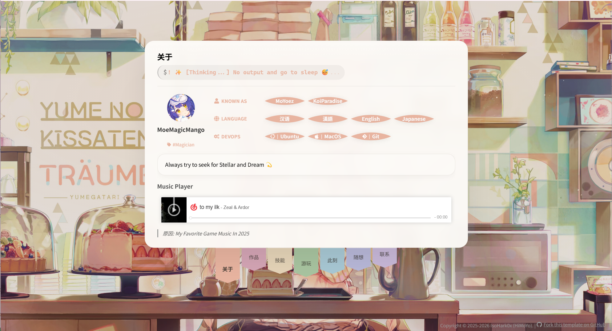

[中文](README-ZH-CN.md) | **English**

> What is Paradise? I don't know — maybe on the rainbow?


<p align="center">
<h2 align="center">Paradise Imagination</h2>

  
</p>

✨Inspired by spontaneous imagination, this site categorizes pages by the colors of the rainbow, presenting content like a stage show.

> Maple, Sunset, Sand, Forest, Stream, Bluebell, Wisteria, means seven color of rainbow.

---

## Tech Stack

- **Next.js 16**
- **React 19**
- **Tailwind CSS 4**
- **TypeScript**

---

## Getting Started

### Prerequisites

- Node.js 18+
- npm / pnpm / yarn

### Install & Run

```bash
# requirement install.
pnpm install

# Let's roll with magic~
pnpm run dev
```

Open [http://localhost:3000](http://localhost:3000).


> If you need to integrate Steam, you need to add STEAM_WEB_API_KEY and STEAM_USER_ID_64 to your env before using.

### Build

```bash
npm run build
npm start
```

---

## Deployment

### Vercel (recommended)

[](
https://vercel.com/new/clone?repository-url=https://github.com/MoYoez/Paradise-Imagination&branch=template&env=STEAM_WEB_API_KEY&envDescription=Steam%20Web%20API%20Key&env=STEAM_USER_ID_64&envDescription=Steam%20User%20ID%20%2864-bit%29
)


### Other platforms

- **Build command:** `npm run build` or `next build`
- **Output directory:** `.next` (use `npm start` or the platform’s Node.js start command; do not serve static files from `.next` directly)
- **Node version:** 18 or 20 (set in platform config or `engines` in `package.json`)

Example `package.json` for Node version:

```json
"engines": {
  "node": ">=18"
}
```

---

## Project Structure

- `app/` — Next.js App Router (pages, layout, globals)
- `content/` — Section content (wisteria, sunset, forest, etc.)
- `components/` — Reusable UI (Stage, AppShell, theme components)
- `contexts/` — React context (e.g. theme)
- `lib/` — Utilities and config

---

## Contact

For more ways to reach out (email, Discord, etc.), see the **Wisteria / 联系** section on the site or the links in the repo author profile.


## Related

- Background artwork: https://www.pixiv.net/artworks/76371065
- AGPL - V3